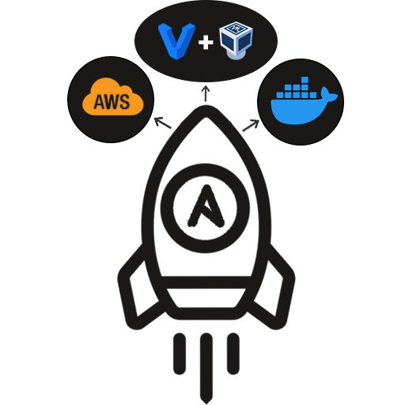

<h1 align="center">
  </img>
  <br>
  <b>Ansible Web application Deployment</b>
</h1>

<p align="center">Auto deploy web application with Ansible in multi base: EC2, VMachine, Container,..</p>

<!-- Badges -->
<p align="center">
  <a href="https://github.com/QuanBlue/ansible-web-app-deployment/graphs/contributors">
    
  </a>
  <a href="">
    
  </a>
  <a href="https://github.com/QuanBlue/ansible-web-app-deployment/network/members">
    
  </a>
  <a href="https://github.com/QuanBlue/ansible-web-app-deployment/stargazers">
    
  </a>
  <a href="https://github.com/QuanBlue/ansible-web-app-deployment/issues/">
    
  </a>
  <a href="https://github.com/QuanBlue/ansible-web-app-deployment/blob/main/LICENSE">
    
  </a>
</p>

<p align="center">
  <b>
    <a href="https://github.com/QuanBlue/ansible-web-app-deployment">Documentation</a> •
    <a href="https://github.com/QuanBlue/ansible-web-app-deployment/issues/">Report Bug</a> •
    <a href="https://github.com/QuanBlue/ansible-web-app-deployment/issues/">Request Feature</a>
  </b>
</p>
<br/>
<details open>
<summary><b>Table of Contents</b></summary>

- [Getting Started](#toolbox-getting-started)
  - [Prerequisites](#prerequisites)
  - [Environment Variables](#environment-variables)
  - [Run Locally](#run-locally)
- [Usage](#rocket-usage)
- [Roadmap](#world_map-roadmap)
- [Contributors](#busts_in_silhouette-contributors)
- [Credits](#sparkles-credits)
- [License](#scroll-license)
</details>

# :toolbox: Getting Started

## Prerequisites

Before proceeding with the installation and usage of this project, ensure that you have the following prerequisites in place:

- **Network Connectivity:** Docker requires network connectivity to download images, communicate with containers, and access external resources.
- Each machine base have its own require

  - **Container base:**
    - _Docker Engine_, Install [here](https://www.docker.com/get-started/).
  - **Virtual machine base:**
    - _Virtualbox version:_ `>= 7.0.6`, Install [here](https://www.virtualbox.org/wiki/Downloads).
    - _Vagrant version:_ `>= 2.3.7`, Install [here](https://www.vagrantup.com/downloads).
    - _Vagrant plugin:_
      - vagrant-scp:
        ```
        vagrant plugin install vagrant-scp`
        ```
  - **EC2 base:**

    - _AWS CLI_, Install [here](https://docs.aws.amazon.com/cli/latest/userguide/getting-started-install.html)

## Environment Variables

If you wanna run this project with ec2 base, you must set up environment variables in `.env` file in `./aws-ec2`

**EC2 config (`.env`):**

- `AWS_ACCESS_KEY_ID`\*: Unique identifier for AWS authentication.
- `AWS_SECRET_ACCESS_KEY`\*: Confidential key for securely signing AWS API requests.
  > Get access key id and secret at [here](https://docs.aws.amazon.com/powershell/latest/userguide/pstools-appendix-sign-up.html)
- `AWS_REGION`: AWS server location for services (default: ap-southeast-1)
  > List [AWS available region](https://docs.aws.amazon.com/AWSEC2/latest/UserGuide/using-regions-availability-zones.html#concepts-available-regions)
- `AMI_ID`: Identifier for AMD processors (default: ami-0df7a207adb9748c7)
  > - Find AMI_ID at [here](https://docs.aws.amazon.com/AWSEC2/latest/UserGuide/finding-an-ami.html)
  > - Make sure that `AMI_ID` running it in the `AWS_REGION` that you want to deploy to.
- `INSTANCE_NAME`: Unique identifier for virtual servers. (default: quanblue)
- `INSTANCE_TYPE`: AWS server configuration specification. (default: t2.micro)
  > List [AWS available instance type](https://aws.amazon.com/ec2/instance-types/)
- `KEY_PAIR_NAME`: name of key pair (default: quanblue_key_pair)
- `SECURITY_GROUP_NAME`: name of security group (default: quanblue_sg)

Example:

```sh
# .env

AWS_ACCESS_KEY_ID=[your access key]
AWS_SECRET_ACCESS_KEY=[your secret key]
AWS_REGION=ap-southeast-1

AMI_ID=ami-0df7a207adb9748c7

INSTANCE_NAME=quanblue
INSTANCE_TYPE=t2.micro
KEY_PAIR_NAME=quanblue_key_pair
SECURITY_GROUP_NAME=quanblue_sg
```

> **Note:**
>
> - Which environment variables **not have default value**, you need to add it to `.env` file.
> - You can also check out the file `.env.example` to see all required environment variables.
> - If you want to use this example environment, you need to rename it to **.env**.

## Run Locally

To deploy this project, with each base, follow these steps:

**Container base:**

```sh
bash ./container_deploy.sh
```

**Virtual machine base:**

```sh
bash ./vmachine_deploy.sh
```

**EC2 base:**

```sh
bash ./ec2_deploy.sh
```

# :rocket: Usage

Automatic deploy web application with 3 base: `container`, `virtual machine` and `ec2` follow these steps:

- Remove all old machine and component attach with them
- Create new machines (Ansible and remote machines)
- Set up ssh key for machines
- Generate inventory file
- From Ansible machine:
  - Add remote machines to the known hosts list
  - Copy all setup files from host machine
  - Play playbook to setup remote machines

# :world_map: Roadmap

- [x] Deploy
  - [x] Application
  - [x] Deploy monitoring and logging components
- [x] Deploy Application on
  - [x] Docker - Container
  - [x] Vagrant - VMachine
  - [x] AWS - EC2
- [ ] Menu UI

# :busts_in_silhouette: Contributors

<a href="https://github.com/QuanBlue/Linux-Bootstrap/graphs/contributors">
  
</a>

Contributions are always welcome!

# :sparkles: Credits

- [Docker](https://www.docker.com/)
- [Vagrant](https://www.vagrantup.com/)
- [Virtualbox](https://www.virtualbox.org/)
- [Ansible](https://www.ansible.com/)
- [AWS](https://aws.amazon.com/vi/console/)
- Emojis are taken from [here](https://github.com/arvida/emoji-cheat-sheet.com)

# :scroll: License

Distributed under the MIT License. See <a href="../LICENSE">`LICENSE`</a> for more information.

---

> Bento [@quanblue](https://bento.me/quanblue) &nbsp;&middot;&nbsp;
> GitHub [@QuanBlue](https://github.com/QuanBlue) &nbsp;&middot;&nbsp; Gmail quannguyenthanh558@gmail.com
